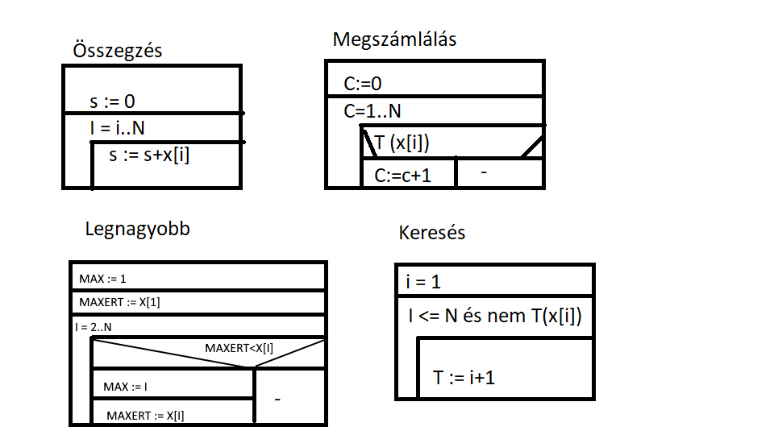

# Programozás óra 5. óra 2023.10.02

## Proramkészítés folyamata

### 1. Specifikáció (Miből? Mit?) - specifikáció
- Célja
    - Feladat formalizálása
        - A megszerzett információkat összegzi
- Összetevői
    - Bemenő adatok
    - Előfeltétel (Ismeret a bemenetről)
    - Eredmény
    - Utófeltétel (Eredményt meghatározó)
    - Használt fogalmak
    - Megoldással szembeni követelmények
    - Korlátozó tényezők

### 2. Tervezés (Mivel? Hogyan?) - adat + algoritmus

- Algoritmus
    - Elemi tevékenységek:
        - Értékeladás, beolvasás, kiírás
    - Összetevői:
        - Szekvencia (egymás utáni végrehajtás)
        - Elágazás
        - Ciklus
        - Alprogram (összetett tevékenység egyedi néven)
    - Algoritmus leíró nyelvek
        - Szöveges leírás
            - Mondatokkal való leírás
            - Mondatszerű elemekkel - pszeudokód
        - Rajzos leírás
            - Folyamatábra
            - Struktogram

### 3. Kódolás (Reprezentáció, implementáció)

- Robert L. Martin

### 4. Teszelés (Hibás-e?)

- Hibalista
- Test Driven Development
- Unit

### 5. Hibakeresés

- Hiba helye
- Hiba oka

### 6. Hibajavítás

### 7. Minőségjavítás, hatékonyság növelés (jobbítható-e?, hogyan?)

### 8. Dokumentálás (hogyan működik)

- Fejlesztői
- Felhasználói

### 9. Használat, karbantartás (még mindig jó?)

## Struktogram

- Kék: Szekvencia
- Zöld: Elágazások
- Piros: Ciklusok


## Programozási tételek

### Tételek lényege
- Célja:
    - Bizonyíthatóan helyes sablon, amelyer magasabb szinten lehet építeni a megoldást. (A fejlesztés gyorsabb és biztonságosabb.)
- Szerkezete:
    - absztrakt feladat specifikáció
    - absztrakt algoritmus
- Kritérium:
    - A bemenet legalább egy sorozat

### Összegzés tétele
- x: Tömb, lista (Ő tárolja az adatokat)
- s: Változó (Ő tárolja az összeget)
- 1..N: Lista indexei

s := 0
I = 1..N
    s := s+x[I]

### Összeszorzás

s := 0
I = i..N
s := f(s,x[i])

f: +, *, összefűzés, únió

```Python
s=0
for i in range(len(x)):
    s=s+x[i]
```



### Megszámlálás
c: változó, azok darabszáma, melyekre igaz T
T: feltétel, igaz/hamis

c := 0
c = 1..N
T(x[i])
c:=c+1

```Python
def T(n):
    return n % 2 == 0
c=0
for i in range(len(x)):
    if T(x[i]):
    c = c + 1
```

### Legnagyobb érték
Max ért: Max érték
Max indexe: Max érték indexe

Max ért := x[i]
Max indexe := 1
i = 2..N
i\ x[i] > Max ért
```Python
x = [1, 5, 2]
N = 0
ind = 0

for i in range(len(x)):
    if x[i] > N:
        N = x[i]
        ind = i
print(N, ind)
```
### Keresés
i = 1
i <= N és nem T(x[i])
T := i+1
Van := i <= N

```Python
N = len(x-1)
i = 0
while i <= N and not(T(x[i])):
    i += 1
van i <= N
if van:
```
