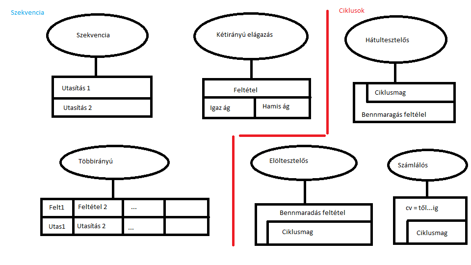

# Programozás óra 5. óra 2023.10.02

### 1. Specifikáció (Miből? Mit?)

- Bemenő adatok
- Előfeltétel (Ismeret a bemenetről)
- Eredmény
- Utófeltétel (Eredményt meghatározó)
- Használt fogalmak
- Megoldással szembeni követelmények
- Korlátozó tényezők

### 2. Tervezés (Mivel? Hogyan?) - adat + algoritmus

- Algoritmus
    - Elemi tevékenységek
        - Értékeladás, beolvasás, kiírás
    - Összetett tevékenységek
        - Szekvencia
        - Elágazás
        - Alprogram
    - Algoritmus leíró nyelvek
        - Szöveges leírás
            - Mondatokkal való leírás
            - Mondat szerű elemekkel (Szerudo kód)
        - Rajzos leírás
            - Strugtogram
            - Folyamat ábra

### 3. Kódolás (Reprezentáció, implementáció)

- Robert L. Martin

### 4. Teszelés (Hibás-e?)

- Hibalista
- Test Driven Development
- Unit

### 5. Hibakeresés

- Hiba helye
- Hiba oka

### 6. Hibajavítás

### 7. Minőségjavítás, hatékonyság növelés

### 8. Dokumentálás

- Fejlesztői
- Felhasználói

### 9. Használat, karbantartás

## Struktogram

## Összegzés
- x: Tömb, lista (Ő tárolja az adatokat)
- s: Változó (Ő tárolja az összeget)
- 1...N: Lista indexei