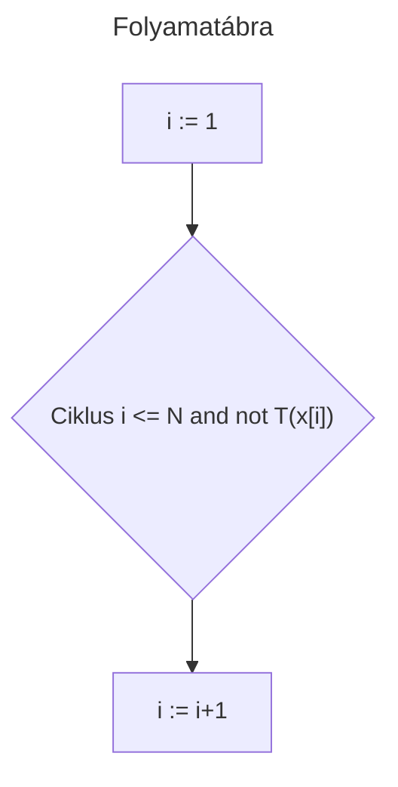
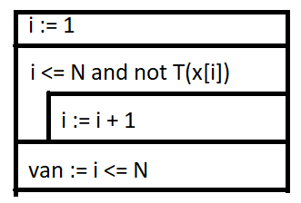
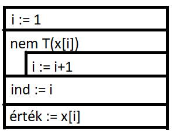

# Programozás óra 6. óra 2023.10.09

### Eldöntés
```Python
i := 1
Ciklus i <= N and not T(x[i])
    i:= i+1
Ciklus vége
van := i <= N
```


flowchart Top-Down vagy Left-Right



### Kiválasztás
```Python
i := 1
nem T(x[i])
    i := i+1
ind := i
érték := x[i]
```
