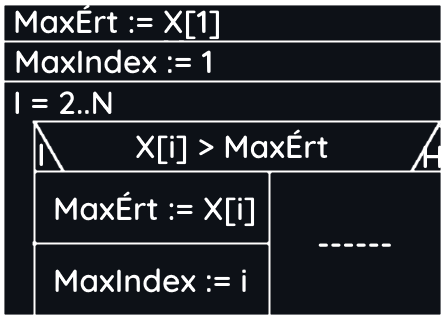
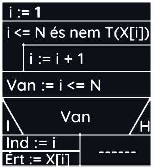

# Programozási tételek

> Frissítve 2024.02.26. 11:45

## Összegzés tétele

- Elemek száma: N
- Számok: X N db elem
- Változó: S (Tárolja az összeget)

```Python
s = 0
for i in range(len(X)):
    s += X[i]
```


## Megszámlálás

- Elemek száma: N
- Számok: X N db elem
- Változó: C (Tárolja, hogy hány db-ra igaz a T feltétel)
- T: Igaz/Hamis értékű feltétel

```Python
c = 0
for i in range(len(X)):
    if X[i]%2==0:
        c += 1
```


## Legnagyobb érték

- Elemek száma: N
- Számok: X N db elem
- MAX: Legnagyobb érték indexe
- MAXERT: Legnagyobb érték

```Python
MaxÉrt = X[0]
MaxIndex = 0
for i in range(1, len(X)):
    if(X[i] > MaxÉrt):
        MaxÉrt = X[i]
        MaxIndex = i
```



## Keresés

- Elemek száma: N
- Számok: X N db elem
- VAN: változó I/H értékkel
- T: Hamis értékű változó

```Python
N = len(X)-1
i = 0
while i <= N and not T(X[i]):
    i += 1
van = i <= N
if van:
    ind = i
    ert = X[i]
```



## Eldöntés

- Elemek száma: N
- Számok: X N db elem
- VAN: változó I/H értékkel
- T: Hamis értékű változó

```Python
N = len(X)-1
i = 1
while i <= N and not T(X[i]):
    i += 1
van = i <= N
```


## Kiválasztás

- Számok: X N db elem
- VAN: változó I/H értékkel
- T: Hamis értékű változó

```Python
N = len(X)-1
i = 0
while not T(X[i]):
    i += 1
ind = i
ert = X[i]
```


