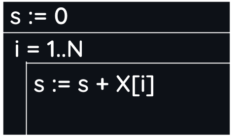
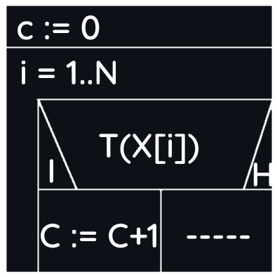

## Edit: Használjatok sötét módot :)
### Összegzés tétele
- Elemek száma: N
- Számok: X N db elem
- Változó: S (Tárolja az összeget)

```Python
S := 0
Ciklus I=1-től N-ig
    S:=S+X[I]
Ciklus vége
```



### Megszámlálás
- Elemek száma: N
- Számok: X N db elem
- Változó: C (Tárolja, hogy hány db-ra igaz a T feltétel)
- T: Igaz/Hamis értékű feltétel

```Python
C:=0
Ciklus I=1-től N-ig
    Ha T(X[I])
        C:=C+1
Ciklus vége
```



### Legnagyobb érték
- Elemek száma: N
- Számok: X N db elem
- MAX: Legnagyobb érték indexe
- MAXERT: Legnagyobb érték

```Python
MAX := 1
MAXERT := X[1]
Ciklus I=2-től N-ig
    Ha MAXERT<X[I]
        MAX := I
        MAXERT := X[I]
    Elágazás vége
Ciklus vége
```


### Keresés
- Elemek száma: N
- Számok: X N db elem
- VAN: változó I/H értékkel
- T: Hamis értékű változó

```Python
I:=1
Ciklus I≤N és nem T(X[I])
    I:=I+1
Ciklus vége
VAN:=(I≤N)
Ha VAN
    SORSZ:=I
```


